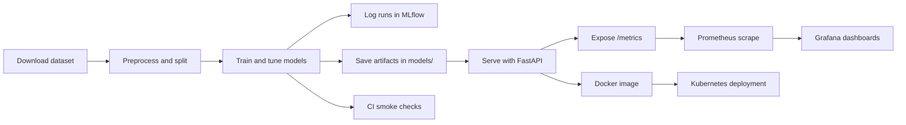
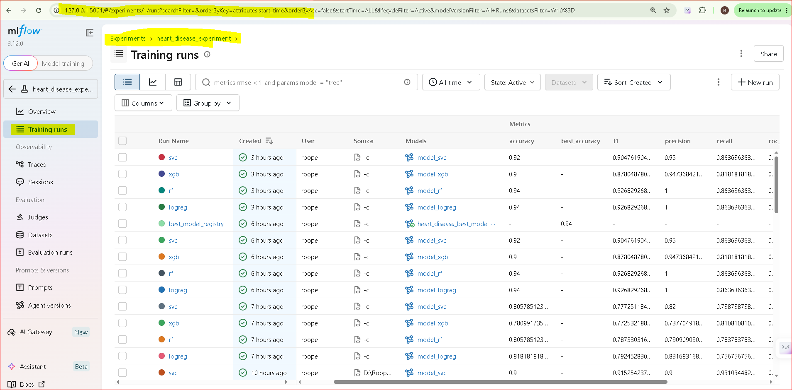
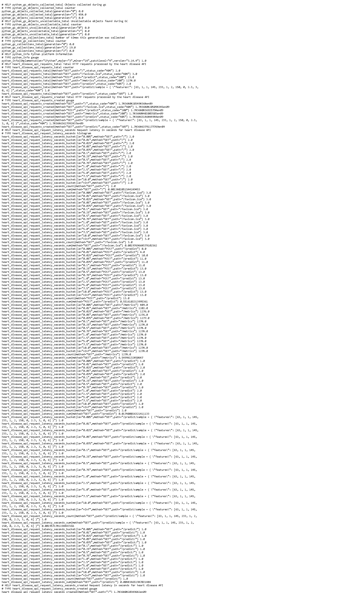
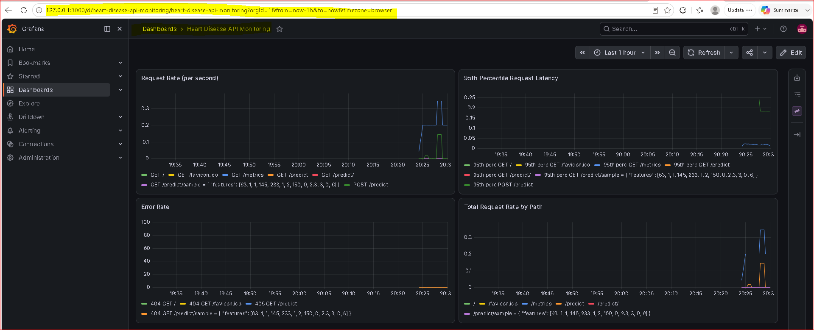

# mlops-heart-disease

Small end-to-end MLOps project for the UCI Heart Disease dataset. Includes data ingestion, preprocessing pipeline, model training (multiple classifiers), evaluation, plotting, MLflow experiment tracking, and a simple FastAPI prediction endpoint.

## Quick start

1. Create environment (recommended):

```bash
conda env create -f environment.yml
conda activate mlops-heart-disease
```

Or install with pip into a venv:

```bash
python -m venv .venv
.venv\\Scripts\\activate
pip install -r requirements.txt
```

2. Download raw data:

```bash
python scripts/download_data.py
```

3. Preprocess and split:

```bash
python -c "from src.data_preprocessing import load_csv, clean_df, preprocess_and_split; df=clean_df(load_csv('data/raw/heart.csv')); preprocess_and_split(df)"
```

4. Train (with optional tuning):

Grid search (default param grids):

```bash
python -c "from src.train import train_from_csv; train_from_csv('data/processed/train.csv', out_dir='models', tuning_method='grid')"
```

Randomized search (faster):

```bash
python -c "from src.train import train_from_csv; train_from_csv('data/processed/train.csv', out_dir='models', tuning_method='random', n_iter=30)"
```

5. Generate evaluation plots (ROC, PR, confusion matrices):

```bash
python scripts/generate_eval_plots.py
```

6. Run tests:

```bash
.venv\\Scripts\\python.exe -m pytest -q
```

7. Start API (loads `models/best_model.joblib`):

```bash
uvicorn src.api:app --reload --port 8000
```

## Docker build/run verification

The repository includes a container image definition in `Dockerfile`. For local production-readiness verification, use the following commands to build the image, run it, and test the prediction endpoint with a sample payload:

```bash
docker build -t mlops-heart-disease:local .
docker run --rm -p 8000:8000 --name heart-api mlops-heart-disease:local
```

In a second terminal, send a sample request:

```bash
curl -X POST http://127.0.0.1:8000/predict \
  -H "Content-Type: application/json" \
  -d '{"features":[63,1,1,145,233,1,2,150,0,2.3,3,0,6]}'
```

Expected response:

```json
{ "prediction": 0, "confidence": 0.42300383253750073 }
```

This is the same sample input used during local API verification for the project, and it confirms that the deployed model endpoint responds correctly for inference requests.

## Architecture Diagram



## Evidence Screenshots

MLflow, Prometheus, and Grafana evidence captured from local runtime (latest screenshot set):







Kubernetes and CI evidence screenshot placeholders for submission packaging:

- `screenshots/workflows/k8s-deployment-status.png`
- `screenshots/workflows/deployed-api-metrics-endpoint.png`
- `screenshots/workflows/deployed-api-predict-endpoint.png`
- `screenshots/workflows/ci-run-summary.png`

## Proof And Evidence Summary

1. Claim: API is containerized and runnable locally.
   Evidence: Docker build and run commands in this README under Docker build/run verification.

2. Claim: `/predict` accepts JSON input and returns prediction plus confidence.
   Evidence: Sample request and response shown in this README (`{"prediction": 0, "confidence": 0.42300383253750073}`).

3. Claim: Experiment tracking is active with MLflow.
   Evidence: Local UI command and URL, plus screenshot `screenshots/workflows/mlflow-experiments.png`.

4. Claim: Runtime monitoring is enabled via Prometheus/Grafana.
   Evidence: `/metrics` endpoint, Prometheus/Grafana config files, and screenshots `screenshots/workflows/prometheus-metrics.png` and `screenshots/workflows/grafana-dashboard.png`.

5. Claim: Kubernetes deployment path is documented.
   Evidence: `k8s/deployment.yaml`, `k8s/service.yaml`, and deployment commands in this README.

## Understanding the repository

Follow this ordered walkthrough to understand how the code executes end to end.

1. Data Acquisition & Exploratory Data Analysis (EDA)
   - `notebooks/eda.ipynb` and `notebooks/eda_executed.ipynb`
     - analyze raw feature distributions and missing values
     - visualize class balance between positive and negative heart disease cases
     - create histograms, correlation heatmaps, and pairplots for selected features
     - document preprocessing decisions based on observed feature relationships

2. Data ingestion and cleaning
   - `scripts/download_data.py`
     - downloads the UCI Cleveland heart disease dataset into `data/raw/heart.csv`
   - `src/data_preprocessing.py`
     - loads the raw CSV
     - cleans missing values and duplicate rows
     - fills numeric and categorical missing values
     - saves preprocessed datasets and the preprocessing artifact
   - `src/preprocessing_pipeline.py`
     - builds the scikit-learn preprocessing pipeline
     - applies median imputation and scaling for numeric features
     - applies one-hot encoding for categorical features

3. Model training and selection
   - `src/train.py`
     - loads processed train data
     - trains multiple candidate models
     - optionally performs hyperparameter search (grid or random)
     - evaluates performance using cross-validation
     - saves model artifacts to `models/`
     - logs metrics and artifacts to MLflow when available

4. Model evaluation
   - `scripts/generate_eval_plots.py`
     - loads saved models and test data
     - generates ROC, precision-recall, and confusion matrix plots
     - saves evaluation artifacts to `screenshots/`
     - optionally uploads artifacts to MLflow

5. Service deployment
   - `src/api.py`
     - loads `models/best_model.joblib` and `models/preprocessor.joblib`
     - exposes `POST /predict` for inference
     - exposes `GET /metrics` for Prometheus monitoring
     - records request count, latency, and error metrics
   - `Dockerfile`
     - packages the API into a Docker image
   - `k8s/deployment.yaml` and `k8s/service.yaml`
     - define deployment and service manifests for Kubernetes

6. Monitoring and observability
   - `monitoring/prometheus.yml`
     - configures Prometheus to scrape `GET /metrics`
   - `monitoring/grafana/dashboard.json`
     - dashboard definition for request rate, latency, and error monitoring

7. Continuous integration
   - `.github/workflows/ci.yml`
     - installs dependencies
     - runs flake8 linting and pytest tests
     - performs a quick smoke training run
     - uploads the `models/` directory as a CI artifact

## Important files

- `scripts/download_data.py` — downloads UCI Cleveland dataset to `data/raw/heart.csv`.
- `src/preprocessing_pipeline.py` — `build_preprocessing()` returns a scikit-learn ColumnTransformer.
- `src/data_preprocessing.py` — cleaning, `preprocess_and_split()` saves processed CSVs and writes `models/preprocessor.joblib`.
- `src/train.py` — training, supports `GridSearchCV`, `RandomizedSearchCV`, and optional Optuna; saves models to `models/` and logs to MLflow when available.
- `scripts/generate_eval_plots.py` — creates evaluation plots and logs artifacts to MLflow when available.
- `src/api.py` — FastAPI prediction and metrics service.
- `Dockerfile` — container packaging for the API.
- `k8s/deployment.yaml` / `k8s/service.yaml` — Kubernetes deployment and service manifests.
- `monitoring/prometheus.yml` — Prometheus scrape config.
- `monitoring/grafana/dashboard.json` — Grafana dashboard definition.
- `notebooks/` — EDA and evaluation notebooks (executed copies and screenshots included).

## MLflow

- Training and preprocessing runs are logged locally under `mlruns/` when MLflow is installed.
- Start the local MLflow UI with `.venv\Scripts\python.exe -m mlflow ui --host 127.0.0.1 --port 5001`.
- Open `http://127.0.0.1:5001` to inspect experiments, runs, metrics, and artifacts.
- A verified local training run created entries under `mlruns/1/` using `src.train.train_from_csv(...)`.

## Monitoring

- The FastAPI app now exposes Prometheus metrics at `/metrics`.
- Prometheus scrape config is available at `monitoring/prometheus.yml`.
- Grafana dashboard JSON is available at `monitoring/grafana/dashboard.json`.
- Run Grafana with provisioning auto-load (datasource + dashboard):

```bash
docker run --rm -p 3000:3000 --name grafana \
  -v "${PWD}/monitoring/grafana/provisioning:/etc/grafana/provisioning" \
  -v "${PWD}/monitoring/grafana/dashboard.json:/var/lib/grafana/dashboards/dashboard.json" \
  grafana/grafana:latest
```

After startup, open `http://127.0.0.1:3000` and the Prometheus datasource plus dashboard load automatically.

- Metrics tracked: request count, request latency, and error count.
- Verified locally: a live `POST /predict` request returned `200`, and `GET /metrics` exposed `heart_disease_api_requests_total`, `heart_disease_api_request_latency_seconds_bucket`, and `heart_disease_api_errors_total`.
- The Prometheus config is set to scrape `/metrics` for the `heart-disease-api` job, and the Grafana dashboard defines panels for request rate, p95 latency, error rate, and request rate by path.

## Reproducibility

- A fitted preprocessor is saved at `models/preprocessor.joblib` during preprocessing.
- A pinned environment is provided in `environment.yml` for reproducible CI and local environments.
- MLflow tracking is integrated and run artifacts are in `mlruns/` when used.

## CI

- GitHub Actions workflow is in `.github/workflows/ci.yml`: installs deps, runs lint, executes tests, and uploads `models/` as an artifact.

## Repository Link

- https://github.com/2024ac05500/mlops-heart-disease

## License

This repository is provided as course/assignment material. Modify and reuse as needed.
