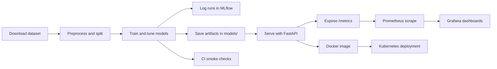

# Step 9 Project Report: Heart Disease MLOps Pipeline

## 1. Executive Summary

This project delivers an end-to-end MLOps pipeline for a heart disease prediction system based on the UCI Cleveland heart disease dataset. It includes:

- data ingestion and preprocessing
- model training with multiple classifiers, hyperparameter tuning, and evaluation
- MLflow-compatible experiment logging
- FastAPI-based prediction service
- Docker packaging and local Kubernetes deployment
- Prometheus/Grafana monitoring for the API
- GitHub Actions CI for linting, testing, and smoke validation

The repository is structured to support reproducible experiment tracking, modular code, and infrastructure-as-code deployment.

## 2. Dataset and Problem Statement

The dataset is the UCI Cleveland heart disease dataset. The task is binary classification: predict whether a patient has heart disease (`target` > 0) or not.

Key features include:

- age, sex, chest pain type (`cp`)
- resting blood pressure (`trestbps`)
- serum cholesterol (`chol`)
- fasting blood sugar (`fbs`)
- resting electrocardiographic results (`restecg`)
- maximum heart rate achieved (`thalach`)
- exercise-induced angina (`exang`)
- ST depression induced by exercise (`oldpeak`)
- slope of peak exercise ST segment (`slope`)
- number of major vessels colored by fluoroscopy (`ca`)
- thalassemia status (`thal`)

The pipeline processes these features and trains a classifier capable of binary heart disease prediction.

## 3. Architecture Overview

### 3.1 Components

- `data/raw/heart.csv` - raw dataset source
- `notebooks/eda.ipynb` / `notebooks/eda_executed.ipynb` - exploratory data analysis, feature distributions, correlation and missing values analysis
- `src/data_preprocessing.py` - cleaning, imputation, encoding, and train/test split
- `src/preprocessing_pipeline.py` - scikit-learn `ColumnTransformer` pipeline for numeric and categorical features
- `src/train.py` - model training, hyperparameter search, evaluation, model persistence
- `src/api.py` - FastAPI service with prediction endpoint and Prometheus metrics
- `Dockerfile` - container packaging for the API
- `k8s/deployment.yaml` / `k8s/service.yaml` - Kubernetes deployment and service manifests
- `monitoring/prometheus.yml` - Prometheus scrape configuration
- `monitoring/grafana/dashboard.json` - Grafana dashboard definition
- `.github/workflows/ci.yml` - CI pipeline

### 3.2 Workflow Diagram

The core workflow is:

1. Download raw data with `scripts/download_data.py`
2. Clean and preprocess data with `src/data_preprocessing.py`
3. Train models in `src/train.py`, save best model and preprocessor to `models/`
4. Start API from `src/api.py` or package into Docker image
5. Deploy to Kubernetes using `k8s/` manifests
6. Collect runtime metrics with Prometheus and visualize via Grafana



## 4. Exploratory Data Analysis (EDA)

The EDA notebooks perform an in-depth review of the raw dataset before modeling. Key analysis includes:

- missing value assessment and imputation strategy justification
- class balance review for `target` labels
- feature distribution histograms for numeric variables
- correlation heatmap analysis to reveal linear relationships and possible multicollinearity
- selected pairplots to inspect relationships between key features and the target
- preprocessing decisions driven by observed feature patterns

The generated artifacts include `screenshots/histograms.png`, `screenshots/class_distribution.png`, `screenshots/correlation_heatmap.png`, and `screenshots/pairplot_selected.png`.

## 5. Data Preprocessing and Feature Engineering

### 5.1 Data cleaning

- raw values are loaded with `pandas`
- missing values marked as `?` are converted to `pd.NA`
- numeric columns are converted to numeric types when possible
- duplicate rows are removed

### 4.2 Imputation

- numeric features: median imputation
- categorical features: most frequent value imputation

### 4.3 Encoding

- categorical features are one-hot encoded with `OneHotEncoder(handle_unknown='ignore')`
- numeric features are scaled using `StandardScaler`

### 4.4 Persistence

- The fitted preprocessing pipeline is saved as `models/preprocessor.joblib`
- Processed splits are saved under `data/processed/`

## 5. Model Training and Evaluation

### 5.1 Models considered

The training pipeline builds and evaluates multiple models.

- Logistic Regression
- Random Forest
- XGBoost / Gradient Boosting
- Support Vector Classifier (SVC)

The pipeline supports both grid search and randomized search.

### 5.2 Training process

- `src/train.py` defines `train_and_log()` and `train_from_csv()` entry points
- models are evaluated with cross-validation
- metrics logged include accuracy, precision, recall, F1 score, and ROC AUC when available
- model artifacts are saved as `models/model_<name>.joblib` and `models/best_model.joblib`
- when MLflow is available, runs are logged locally under `mlruns/` and can be viewed with `python -m mlflow ui --host 127.0.0.1 --port 5000`

### 5.3 Evaluation artifacts

The repository contains evaluation artifacts generated by `scripts/generate_eval_plots.py`:

- `screenshots/roc_curves.png`
- `screenshots/pr_curves.png`
- `screenshots/confusion_best_model.png`
- `screenshots/confusion_model_logreg.png`
- `screenshots/confusion_model_rf.png`
- `screenshots/confusion_model_svc.png`

These plots show model discrimination and classification performance across candidate models.

### 5.4 Experiment tracking summary

- MLflow logging is enabled in training and preprocessing when the `mlflow` package is available.
- Runs are stored in the local tracking directory: `mlruns/`.
- Training logs model metrics (accuracy, precision, recall, F1, ROC AUC), model artifacts, and selected plots.
- Local UI command:

```bash
.venv\Scripts\python.exe -m mlflow ui --host 127.0.0.1 --port 5000
```

- Local UI URL: `http://127.0.0.1:5000`

MLflow UI screenshot (Experiments view):


## 6. API Design and Runtime Monitoring

### 6.1 FastAPI service

The prediction API is implemented in `src/api.py` and exposes:

- `POST /predict` - accepts input JSON with `features: list`
- `GET /metrics` - Prometheus scrape endpoint for runtime metrics

During startup, the service loads:

- `models/best_model.joblib`
- `models/preprocessor.joblib`

The `/predict` endpoint accepts raw feature vectors in the expected column order and either applies the saved preprocessor or assumes the client already provided transformed features.

### 6.2 Prometheus metrics

The application exports three custom metrics:

- `heart_disease_api_requests_total{method,path,status_code}`
- `heart_disease_api_request_latency_seconds{method,path}`
- `heart_disease_api_errors_total{method,path,status_code}`

The middleware records request latency, request volume, and error count for all incoming HTTP traffic.

### 6.3 Monitoring manifests

- `monitoring/prometheus.yml` configures Prometheus to scrape `/metrics`
- `monitoring/grafana/dashboard.json` defines a Grafana dashboard with:
  - request rate timeseries
  - 95th-percentile latency
  - error rate
  - request rate by path

### 6.4 Verified local monitoring evidence

- the API was started locally with Uvicorn and exposed `http://127.0.0.1:8000/metrics`
- a live `POST /predict` request returned `200` with a prediction payload, generating fresh metrics
- the metrics endpoint returned the custom Prometheus series:
  - `heart_disease_api_requests_total`
  - `heart_disease_api_request_latency_seconds_bucket`
  - `heart_disease_api_errors_total`
- the Grafana dashboard file contains PromQL panels for request rate, p95 latency, error rate, and request rate by path against those exported metrics

Prometheus metrics endpoint screenshot:


## 7. Containerization and Kubernetes Deployment

### 7.1 Docker packaging

The `Dockerfile` builds a minimal Python container with all dependencies from `requirements.txt`.

Build command:

```bash
docker build -t heart-disease-api:latest .
```

Run locally:

```bash
docker run --rm -p 8000:8000 heart-disease-api:latest
```

### 7.2 Kubernetes deployment

The Kubernetes manifests are stored in `k8s/`.

Deploy the API with:

```bash
kubectl apply -f k8s/deployment.yaml
kubectl apply -f k8s/service.yaml
```

The service exposes the app on port 80 and routes traffic to container port 8000.

### 7.3 Local K8s notes

For Windows local Kubernetes, using Minikube with the Docker Desktop driver is recommended. The `imagePullPolicy: IfNotPresent` allows a locally built image to be used after loading it into Minikube.

If deploying into Minikube, use:

```bash
minikube image load heart-disease-api:latest
```

This avoids `ErrImagePull` for locally built images.

## 8. CI/CD and Quality Validation

### 8.1 GitHub Actions

The CI workflow is defined in `.github/workflows/ci.yml`.
It performs:

- code checkout
- Python 3.10 setup
- dependency installation from `requirements.txt`
- linting with `flake8` (`--max-line-length=120`)
- unit tests via `pytest`
- quick smoke training run using synthetic data
- artifact upload of the `models/` directory

This pipeline validates both code style and core training functionality.

### 8.2 Testing and linting

- `pytest` is used for functional and unit tests
- `flake8` enforces style constraints and catches syntax issues

### 8.3 CI/CD and deployment workflow screenshots

- Add CI workflow run screenshots under `screenshots/workflows/` (for example, lint/test/smoke stages from GitHub Actions).
- Add deployment workflow screenshots under `screenshots/workflows/` (for example, Docker build, Kubernetes apply, service exposure).
- Reference files in this report after capturing them, for example:
  - `screenshots/workflows/ci-run-summary.png`
  - `screenshots/workflows/docker-build-success.png`
  - `screenshots/workflows/k8s-deployment-status.png`

## 9. Reproducibility and Environment

### 9.1 Dependency management

The repository includes both:

- `requirements.txt` for pip-based installation
- `environment.yml` for Conda-based reproducibility

`environment.yml` includes pinned versions for Python, scikit-learn, MLflow, Prometheus client, and other runtime libraries.

### 9.2 Reproducible model artifacts

- `models/preprocessor.joblib` preserves the exact transformation logic used during training
- `models/best_model.joblib` preserves the chosen predictive model

These artifacts ensure runtime prediction consistency with training preprocessing.

## 10. Usage Guide

### 10.1 Local environment setup

```bash
conda env create -f environment.yml
conda activate mlops-heart-disease
```

Or using pip:

```bash
python -m venv .venv
.venv\Scripts\activate
pip install -r requirements.txt
```

### 10.2 Data pipeline

```bash
python scripts/download_data.py
python -c "from src.data_preprocessing import load_csv, clean_df, preprocess_and_split; df = clean_df(load_csv('data/raw/heart.csv')); preprocess_and_split(df)"
```

### 10.3 Train models

```bash
python -c "from src.train import train_from_csv; train_from_csv('data/processed/train.csv', out_dir='models', tuning_method='grid')"
```

### 10.4 MLflow UI

```bash
.venv\Scripts\python.exe -m mlflow ui --host 127.0.0.1 --port 5000
```

Open `http://127.0.0.1:5000` to inspect locally logged runs in `mlruns/`.

### 10.5 Run API

```bash
uvicorn src.api:app --reload --port 8000
```

### 10.6 Docker & Kubernetes

```bash
docker build -t heart-disease-api:latest .
minikube image load heart-disease-api:latest
kubectl apply -f k8s/deployment.yaml
kubectl apply -f k8s/service.yaml
```

### 10.7 Monitoring

- Prometheus config: `monitoring/prometheus.yml`
- Grafana dashboard: `monitoring/grafana/dashboard.json`
- API metrics endpoint: `http://127.0.0.1:8000/metrics` for local verification

## 11. Project Outcomes

This repository demonstrates a complete MLOps workflow including:

- data processing and feature engineering
- multi-model experimentation and evaluation
- runtime model serving with a production-ready API
- containerization and local Kubernetes deployment
- monitoring via Prometheus and Grafana
- automated CI quality checks

## 12. Key Learnings and Observations

- Reproducible model serving requires saving both the trained model and preprocessor.
- Local Kubernetes deployment on Windows is more reliable when the Docker Desktop driver is used and local images are loaded into the cluster.
- Prometheus middleware inside FastAPI enables lightweight observability for API performance and errors.
- CI should validate not only tests, but also a smoke training run to ensure the training pipeline remains executable.

## 13. References

- `README.md`
- `Dockerfile`
- `k8s/deployment.yaml`
- `k8s/service.yaml`
- `monitoring/prometheus.yml`
- `monitoring/grafana/dashboard.json`
- `.github/workflows/ci.yml`
- `src/api.py`
- `src/train.py`
- `src/data_preprocessing.py`
- `src/preprocessing_pipeline.py`
- `scripts/download_data.py`
- `scripts/generate_eval_plots.py`

## 14. Available Artifacts

- CI workflow: `.github/workflows/ci.yml`
- Docker image packaging: `Dockerfile`
- Kubernetes manifests: `k8s/deployment.yaml`, `k8s/service.yaml`
- Monitoring files: `monitoring/prometheus.yml`, `monitoring/grafana/dashboard.json`
- Visualization assets: `screenshots/roc_curves.png`, `screenshots/pr_curves.png`, and confusion matrix plots

## 15. Code Repository Link

- Repository URL: https://github.com/2024ac05500/mlops-heart-disease

---

_Report generated from the current repository state and implementation details._
